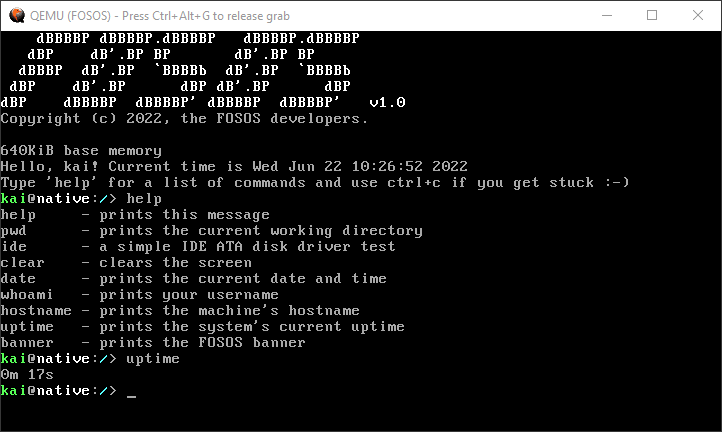

# FOSOS
A simple 32-bit command-line operating system base for developers written in C. It provides a simple but strong base to build your OS on top of, with a simple and permissive [BSD 2-Clause license](LICENSE).

## Screenshot

## Authors
* Creator & main development - [Kaimakan71](https://kaimakan71.github.io)
* C bug help :~) - [CoherenceLabs](https://github.com/CoherenceLabs)
* Helpful articles/tutorials - [OSDev Wiki](https://wiki.osdev.org)

## Todo :~)
###### Note: these are in order of priority
- [x] VGA text mode driver
- [x] (US) Keyboard driver
- [x] Real-time clock and interval timer drivers
- [x] Basic commands
- [x] Serial driver (printf to host console)
- [x] GUI
- [ ] Multitasking
- [ ] Disk driver
- [ ] Filesystem
- [ ] ACPI controller
- [ ] PCI driver/manager
- [ ] Networking (E1000 adapter?)
- [ ] TCP/IP, HTTP/FTP stack (+ custom protocol?)

## Prerequisites
* [NASM](https://www.nasm.us) (assembler)
* [QEMU](https://www.qemu.org) (emulator)
* [Make](https://www.gnu.org/software/make) (build system)
* [GCC](https://gcc.gnu.org) (compiler collection)

## Running
It's easy to try FOSOS, as a prebuilt binary is included with each major update. You can use the makefile command `make run` to start QEMU.

## Building
Building FOSOS is also very simple. You can just run `make` and an updated disk image will be created. Because FOSOS uses Make, only changed files are recompiled, saving build time.

Copyright (c) 2022, the FOSOS developers.
